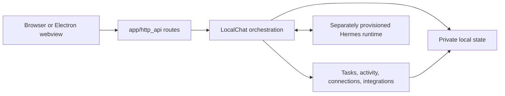

# Architecture

eïlo is a loopback web application with a Python domain layer and a browser
client. The UI is a projection of local state; it does not own commitments,
conversation authority, or permissions.

## Boundaries

- `app/server.py` is the command-line entry point. It owns the loopback process,
  PID record, and start/stop lifecycle.
- `app/http_api/application.py` composes the aiohttp app. Route modules validate
  transport input and call domain services; they do not embed business policy.
- `app/chat_service.py` provides `LocalChat`, the orchestration boundary for a
  conversation turn, task transaction, publication recovery, and state snapshot.
- `app/runtime_contract.py` validates the allowed Hermes model/provider/tool
  contract and projects audited native history into public messages.
- `app/tasks/`, `app/proactive/`, and `app/integrations/` own their respective
  domain logic. Keep features in the smallest domain that can enforce their
  invariants.
- `app/persistence.py` owns private JSON writes. Its atomic replace plus file
  and directory sync establishes the durable commit point.
- `app/errors.py` contains user-safe errors. Do not expose provider diagnostics,
  paths, credentials, or raw upstream responses through HTTP.
- `app/paths.py` centralizes repository-local paths. New state must have an
  explicit owner and remain outside source control.

## Request lifecycle

1. A route accepts only a known method, content type, body shape, and origin.
2. It delegates to the service or owning domain, which validates identifiers,
   revisions, permission state, and schema before mutation.
3. The owner writes the complete new local record durably.
4. Only after that commit can a task projection, receipt, or assistant result
   be published to the browser or native conversation.
5. Clients receive a compact snapshot or event and render it as a projection.

This ordering matters. A failed write must leave no public acknowledgment of an
uncommitted change. Request IDs make retries idempotent; revisions prevent an
older browser state from silently replacing newer state.

## State ownership

| State                                       | Owner                    | Rule                                                                                     |
| ------------------------------------------- | ------------------------ | ---------------------------------------------------------------------------------------- |
| Native conversation/context                 | Hermes                   | eïlo audits and projects it; it does not reconstruct a second transcript.                |
| Goals, focus, breaks, receipts, routing     | eïlo private local state | Every batch validates before replacement; committed state is authoritative for controls. |
| Activity observations                       | Activity ledger          | Keep only admitted, minimized observations under its retention policy.                   |
| Browser drafts and presentation preferences | Browser storage          | Convenience state only; it cannot create or overwrite durable commitments.               |
| Model/runtime sign-in                       | Hermes private home      | Never read, copy, publish, or infer it from source configuration.                        |

## Browser code

`web/` contains production browser source. Feature folders such as `home/`,
`workspace/`, `chat/`, `goals/`, `connections/`, `calendar/`, `activity/`, and
`speech/` keep UI behavior close to its styles and tests. `styles/` holds shared
tokens and base rules; `preview/` contains sample-preview wiring. `assets/`
contains local assets. `web/asset-manifest.json` is the single explicit mapping
used by both the live server and `scripts/preview.mjs`; update it whenever a
served source file changes. Public `/home/` and `/activity-connect` routes are
stable contracts even when the internal source layout changes.

## Where to make a change

| Change                            | Start here                                                        |
| --------------------------------- | ----------------------------------------------------------------- |
| Start/stop or service composition | `app/server.py`, `app/http_api/application.py`                    |
| New endpoint                      | The relevant `app/http_api/` route module, then its owning domain |
| Goal lifecycle or validation      | `app/tasks/`                                                      |
| Native model/runtime constraint   | `app/runtime_contract.py` and driver boundary                     |
| Durable record format             | Owning domain plus `app/persistence.py`                           |
| Home interaction                  | Matching `web/<feature>/` module and focused Node test            |
| Desktop lifecycle                 | `desktop/electron/`                                               |
| Consent-gated activity source     | `app/proactive/`, `app/integrations/`, and `activity/`            |

Keep dependencies directed inward: browser code calls HTTP, routes call domains,
and domains own state. Do not let a browser feature reach local files, credentials,
or a runtime directly.
