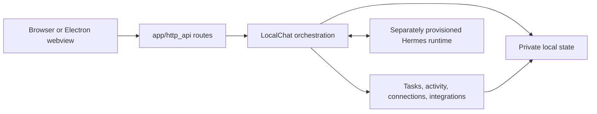

# Architecture

eïlo is a loopback web application with a Python domain layer and a browser
client. The UI is a projection of local state; it does not own commitments,
conversation authority, or permissions.

## Boundaries

- `app/server.py` is the command-line entry point. It owns the loopback process,
  PID record, and start/stop lifecycle.
- `app/http_api/application.py` composes the aiohttp app. Route modules validate
  transport input and call domain services; they do not embed business policy.
- `app/chat_service.py` provides `LocalChat`, the orchestration boundary for a
  conversation turn, task transaction, publication recovery, and state snapshot.
- `app/runtime_contract.py` validates the allowed Hermes model/provider/tool
  contract and projects audited native history into public messages.
- `app/tasks.py`, `app/proactive.py`, and the source connection modules own their
  respective domain logic. Keep features in the smallest domain that can enforce
  their invariants.
- `app/persistence.py` owns private JSON writes. Its atomic replace plus file
  and directory sync establishes the durable commit point.
- `app/errors.py` contains user-safe errors. Do not expose provider diagnostics,
  paths, credentials, or raw upstream responses through HTTP.
- `app/paths.py` centralizes repository-local paths. New state must have an
  explicit owner and remain outside source control.

## Request lifecycle

1. A route accepts only a known method, content type, body shape, and origin.
2. It delegates to the service or owning domain, which validates identifiers,
   revisions, permission state, and schema before mutation.
3. The owner writes the complete new local record durably.
4. Only after that commit can a task projection, receipt, or assistant result
   be published to the browser or native conversation.
5. Clients receive a compact snapshot or event and render it as a projection.

This ordering matters. A failed write must leave no public acknowledgment of an
uncommitted change. Request IDs make retries idempotent; revisions prevent an
older browser state from silently replacing newer state.

## State ownership

| State                                       | Owner                    | Rule                                                                                     |
| ------------------------------------------- | ------------------------ | ---------------------------------------------------------------------------------------- |
| Native conversation/context                 | Hermes                   | eïlo audits and projects it; it does not reconstruct a second transcript.                |
| Goals, focus, breaks, receipts, routing     | eïlo private local state | Every batch validates before replacement; committed state is authoritative for controls. |
| Activity observations                       | Activity ledger          | Keep only admitted, minimized observations under its retention policy.                   |
| Browser drafts and presentation preferences | Browser storage          | Convenience state only; it cannot create or overwrite durable commitments.               |
| Model/runtime sign-in                       | Hermes private home      | Never read, copy, publish, or infer it from source configuration.                        |

## Browser code

`web/` contains production browser source. Feature folders such as `home/`,
`workspace/`, `chat/`, `goals/`, `connections/`, `calendar/`, `activity/`, and
`speech/` keep UI behavior close to its styles and tests. `styles/` holds shared
tokens and base rules; `preview/` contains sample-preview wiring. `assets/`
contains local assets. `web/asset-manifest.json` is the single explicit mapping
used by both the live server and `scripts/preview.mjs`; update it whenever a
served source file changes. Public `/home/` and `/activity-connect` routes are
stable contracts even when the internal source layout changes.

## Chrome context

`activity/extension` owns the optional browser grant and local `excludedHosts` preferences. A protocol-2 readiness message proves that the current extension has the full optional HTTP/HTTPS grant without sampling any tab. `web/activity/bridge.js` waits for readiness before the session enables a server lease. The existing version-1 observation wire shape remains compatible with stored records.

The foreground sampler, `app/accountability.py` origin sanitizer, activity ledger, and event-driver validation admit general minimized browser origins. Source grants, a live page lease, event admission, and delivery controls are separate gates. `web/styles/focus.js` shares keyboard-versus-pointer focus treatment across Home and the standalone connection/setup pages.

## Adaptive context

`app/context_service.py` owns WorkContext and presentation revisions separately from commitments. `context_contract.py` validates consent-bound evidence; `context_store.py` encrypts content with a Keychain key. `context_analysis.py` invokes the isolated, no-tool `adaptive_driver.py`; that path does not write observations to native chat history. `context_capture.py` coordinates the Swift helper and authenticated Native Messaging broker. Rich browser content can arrive only from the extension.

The additive `/api/state` fields are `adaptive`, `capture_status`, `current_work_context`, `home_composition`, and `account`. `/api/home/commands` and `/api/context/commands` use independent revisions and request IDs. Capture has no HTTP ingestion route. `/api/account/commands` manages user-started authorization without sending tokens to browser state.

`web/adaptive/` owns the bounded component catalog and shared content renderer. Its controller keeps the embedded Settings context sections current and defers content updates during typing, selections, dialogs, and widget gestures. Production Home uses one board: `web/home/context-layout.js` reconciles component references into the existing `web/home/layout.js` widget state, preserving manual widgets and saved geometry. No source text is copied into layout storage. Dismissed component references prevent automatic re-addition; Add widgets can restore currently available components. `web/adaptive/renderer.js` renders those contents inside the ordinary widget controls, including independently persisted note drafts. Tracking and usage reuse `web/home/context-widgets.js`. The separate adaptive renderer/geometry/motion remain for the isolated design preview only. The shared router owns Settings and preserves the legacy Connections route. Settings embeds the existing context, account, and connection controls; opening it cancels speech before hiding the composer. Home projects whole cards into bounded pages rather than slicing them at the composer. Page-local gestures merge back into layout metadata without changing other responsive modes. A one-time presentation migration backs up the old layout, deduplicates identical source cards, and aligns them. The original floating navigation uses pointer bounds and an exit delay to avoid reveal flicker.

## Context and accountability

Admitted native browser and desktop events notify `LocalChat.context_changed`.
`ContextService.check_in_context` projects a fresh, minimized observation under
the current source and AI-sharing policy; `ProactiveLoop` applies task, break,
human-grace, stability and budget gates. This path is independent of Home's
display mode and the legacy page lease. Resident check-ins require the existing
Check-ins control to be explicitly enabled; old page-lease state does not grant
this new capability. Source collection, AI sharing and desktop notification
permission remain separate.

`event_driver` reads the exact native conversation and runs detached inference
without writing its observation or draft to native history. The coordinator
keeps draft text private until the message is committed. It
revalidates the result, durably accepts a publication under the native lock, then
asks the driver to append one validated assistant row. Event identity makes the
append idempotent. Human work preempts inference. Validation and the short local
native append do not yield to other commands, so a permission change cannot
interleave with the commit. A changed intention or permission suppresses obsolete delivery. An
uncertain append is reconciled by exact native identity on restart, with no
automatic model or append retry. Recovered native messages remain in conversation
history and cannot generate a fresh desktop notification.

The notification host consumes the service's current eligible event IDs, records
fresh messages as seen before posting, and never replays suppressed messages when
permissions resume. A saved check-in is distinct from an OS notification or a
person reading it.

Requested chat can call `eilo_read_work_context` through the existing ephemeral
source bridge. It reads a current work summary and at most eight allowed recent
episodes, without raw document text, images, a new collection request or an
implicit task mutation. Policy changes invalidate an answer that used this data;
unrelated mail-only turns retain their existing scope.

## Where to make a change

| Change                            | Start here                                                        |
| --------------------------------- | ----------------------------------------------------------------- |
| Start/stop or service composition | `app/server.py`, `app/http_api/application.py`                    |
| New endpoint                      | The relevant `app/http_api/` route module, then its owning domain |
| Goal lifecycle or validation      | `app/tasks.py`                                                    |
| Native model/runtime constraint   | `app/runtime_contract.py` and driver boundary                     |
| Durable record format             | Owning domain plus `app/persistence.py`                           |
| Home interaction                  | Matching `web/<feature>/` module and focused Node test            |
| Desktop lifecycle                 | `desktop/electron/`                                               |
| Consent-gated activity source     | `app/context_service.py`, `app/context_capture.py`, `activity/`   |
| Check-in decisions and recovery   | `app/proactive.py`, `app/event_driver.py`                         |

Keep dependencies directed inward: browser code calls HTTP, routes call domains,
and domains own state. Do not let a browser feature reach local files, credentials,
or a runtime directly.
