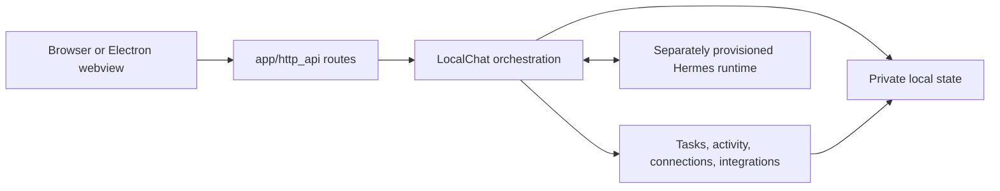

# Architecture

felis is a loopback web application with a Python domain layer and a browser
client. The UI is a projection of local state; it does not own commitments,
conversation authority, or permissions.

## Boundaries

- `app/server.py` is the command-line entry point. It owns the loopback process,
  PID record, and start/stop lifecycle.
- `app/http_api/application.py` composes the aiohttp app. Route modules validate
  transport input and call domain services; they do not embed business policy.
- `app/chat_service.py` provides `LocalChat`, the orchestration boundary for a
  conversation turn, task transaction, publication recovery, and state snapshot.
- `app/runtime_contract.py` validates the allowed Hermes model/provider/tool
  contract and projects audited native history into public messages.
- `app/tasks.py`, `app/proactive.py`, and the source connection modules own their
  respective domain logic. Keep features in the smallest domain that can enforce
  their invariants.
- `app/persistence.py` owns private JSON writes. Its atomic replace plus file
  and directory sync establishes the durable commit point.
- `app/errors.py` contains user-safe errors. Do not expose provider diagnostics,
  paths, credentials, or raw upstream responses through HTTP.
- `app/paths.py` centralizes repository-local paths. New state must have an
  explicit owner and remain outside source control.

## Request lifecycle

1. A route accepts only a known method, content type, body shape, and origin.
2. It delegates to the service or owning domain, which validates identifiers,
   revisions, permission state, and schema before mutation.
3. The owner writes the complete new local record durably.
4. Only after that commit can a task projection, receipt, or assistant result
   be published to the browser or native conversation.
5. Clients receive a compact snapshot or event and render it as a projection.

This ordering matters. A failed write must leave no public acknowledgment of an
uncommitted change. Request IDs make retries idempotent; revisions prevent an
older browser state from silently replacing newer state.

## State ownership

| State                                       | Owner                     | Rule                                                                                     |
| ------------------------------------------- | ------------------------- | ---------------------------------------------------------------------------------------- |
| Native conversation/context                 | Hermes                    | felis audits and projects it; it does not reconstruct a second transcript.               |
| Goals, focus, breaks, receipts, routing     | felis private local state | Every batch validates before replacement; committed state is authoritative for controls. |
| Activity observations                       | Activity ledger           | Keep only admitted, minimized observations under its retention policy.                   |
| Browser drafts and presentation preferences | Browser storage           | Convenience state only; it cannot create or overwrite durable commitments.               |
| Model/runtime sign-in                       | Hermes private home       | Never read, copy, publish, or infer it from source configuration.                        |

## Chat context and compaction

`chat_context_runtime.py` reads Hermes's native display history separately from
the active model context. It includes compaction archives and compression
ancestors, unwraps synthetic summary carriers, and preserves felis publication
metadata when native row IDs change. `chat_context.py` projects only validated
numeric usage anchors and cached limits; it does not probe a provider.

After a completed turn, the live runtime's category estimator is reduced to
allowlisted category IDs and bounded token counts, normalized to the measured
occupancy, and stored beside that session's usage anchor. The projection exposes
the numeric breakdown only while its saved message count matches the active
replay. It never publishes prompt text, tool schemas, skill content, memory, or
provider configuration.

The composer consumes `chat_context` in the existing state snapshot.
`POST /api/chat/context` accepts only a revision-checked, idempotent compression
request for the active conversation. A durable per-chat receipt precedes the
native operation. The same native lock serializes compaction, inference and
publication. Restart resolves native saved history without replaying compression.
Old catalog records gain the two optional control fields before strict validation.

The human driver pins each Hermes compression attempt to its audited main
provider/model and emits only allowlisted compression status values. Context
details never expose auxiliary diagnostics, credentials, or hidden summary text.

## First workspace setup

`app/onboarding.py` owns a revisioned draft separate from real goals. New metadata
initializes it; old profiles without it stay outside onboarding. The human-driver
policy permits bounded goal edits during setup.
`LocalChat.stage_publication` stages those changes through the existing durable
journal without publishing them as saved goals.

`POST /api/onboarding/commands` accepts explicit revision-checked, idempotent
approval, skip and support-status commands. Approval writes goals and setup state
in the same private metadata replacement before acknowledgment. Permission state
is never part of that command. Interrupted inference uses existing recovery.

`web/onboarding/` reuses the conversation dock and source guides. Approval
commits the goal while Home remains a single app-owned composition. Support
guides confirm current collection, sharing, and check-in state independently;
the native alert API confirms only felis's delivery preference, not the OS
authorization setting. Optional synthesized sounds use the existing local
preferences and never alter OS audio.

## Browser code

`web/` contains production browser source. Feature folders such as `home/`,
`workspace/`, `chat/`, `onboarding/`, `goals/`, `connections/`,
`calendar/`, `activity/`, and `speech/` keep UI behavior close to their
styles and tests. `styles/` holds shared tokens and base rules; `assets/`
contains local assets. `web/asset-manifest.json` is the explicit allowlist used
by the live and fixture servers; update it whenever a served source file changes. Public `/home/` and `/activity-connect` routes are
stable contracts even when the internal source layout changes.

The agent orb in `web/orb/` adapts noRot's original point-cloud renderer to the
existing conversation state. One canvas appears above the question during first
setup or an empty conversation. It is detached and paused when the conversation
has messages or is closed; the composer and populated chat have no decorative orb.
It follows the current
accent and reduced-motion setting, pauses out of view, and retains a static
fallback when WebGL is unavailable. Three.js is pinned, served locally and loaded
on visibility; `scripts/vendor-orb.mjs` reproduces its checked-in distribution.
The orb only displays state; it does not initiate capture or inference. See the
[orb attribution](../web/orb/NOTICE.md).

Activity navigation is derived from available records: delivered check-ins and
observed history appear when populated; the agent audit and recoverable deleted
observations use a secondary menu. First-use guidance does not alter collection,
sharing or check-in policy. The check-in switch remains the explicit control.
Home, Goals, Activity and the chat library share the outer page gutters and title
baseline; the conversation retains its centered reading width.

## Chrome context

`activity/extension` owns the optional browser grant and local `excludedHosts` preferences. A protocol-2 readiness message proves that the current extension has the full optional HTTP/HTTPS grant without sampling any tab. `web/activity/bridge.js` waits for readiness before the session enables a server lease. The existing version-1 observation wire shape remains compatible with stored records.

The foreground sampler, `app/accountability.py` origin sanitizer, activity ledger, and event-driver validation admit general minimized browser origins. Source grants, a live page lease, event admission, and delivery controls are separate gates. `web/styles/focus.js` shares keyboard-versus-pointer focus treatment across Home and the standalone connection/setup pages.

## Adaptive context

`app/context_service.py` owns WorkContext and presentation revisions separately from commitments. `context_contract.py` validates consent-bound evidence; `context_store.py` encrypts content with a Keychain key. `context_analysis.py` invokes the isolated, no-tool `adaptive_driver.py`; that path does not write observations to native chat history. `context_capture.py` coordinates the Swift helper and authenticated Native Messaging broker. Rich browser content can arrive only from the extension.

The additive `/api/state` fields are `adaptive`, `capture_status`, `current_work_context`, `home_composition`, and `account`. `/api/home/commands` and `/api/context/commands` use independent revisions and request IDs. Capture has no HTTP ingestion route. `/api/account/commands` manages user-started authorization without sending tokens to browser state.

`web/adaptive/` owns the Settings permission and retention controls.
`controller.js` projects the service's context policy into the embedded
Settings surface; it does not compose or render Home. `web/home/unified-workspace.js`
owns the one Home composition and its return foreground. The shared router keeps
Settings separate while Goals and Activity open in dismissible Home detail views.
The browser persists only presentation preferences; commitments, activity,
conversation state, permissions, and source health remain server-owned.

## Context and accountability

Admitted native browser and desktop events notify `LocalChat.context_changed`.
`ContextService.check_in_context` projects a fresh, minimized observation under
the current source and AI-sharing policy; `ProactiveLoop` applies task, break,
human-grace, stability and budget gates. This path is independent of Home presentation and the compatibility page lease. Resident check-ins require the existing
Check-ins control to be explicitly enabled; old page-lease state does not grant
this new capability. Source collection, AI sharing and desktop notification
permission remain separate.

`event_driver` reads the exact native conversation and runs detached inference
without writing its observation or draft to native history. The coordinator
keeps draft text private until the message is committed. It
revalidates the result, durably accepts a publication under the native lock, then
asks the driver to append one validated assistant row. Event identity makes the
append idempotent. Human work preempts inference. Validation and the short local
native append do not yield to other commands, so a permission change cannot
interleave with the commit. A changed intention or permission suppresses obsolete delivery. An
uncertain append is reconciled by exact native identity on restart, with no
automatic model or append retry. Recovered native messages remain in conversation
history and cannot generate a fresh desktop notification.

The notification host consumes the service's current eligible event IDs, records
fresh messages as seen before posting, and never replays suppressed messages when
permissions resume. A saved check-in is distinct from an OS notification or a
person reading it.

Requested chat can call `eilo_read_work_context` through the existing ephemeral
source bridge. It reads a current work summary and at most eight allowed recent
episodes, without raw document text, images, a new collection request or an
implicit task mutation. Policy changes invalidate an answer that used this data;
unrelated mail-only turns retain their existing scope.

## Where to make a change

| Change                            | Start here                                                        |
| --------------------------------- | ----------------------------------------------------------------- |
| Start/stop or service composition | `app/server.py`, `app/http_api/application.py`                    |
| New endpoint                      | The relevant `app/http_api/` route module, then its owning domain |
| Goal lifecycle or validation      | `app/tasks.py`                                                    |
| Native model/runtime constraint   | `app/runtime_contract.py` and driver boundary                     |
| Durable record format             | Owning domain plus `app/persistence.py`                           |
| Home interaction                  | Matching `web/<feature>/` module and focused Node test            |
| Desktop lifecycle                 | `desktop/electron/`                                               |
| Consent-gated activity source     | `app/context_service.py`, `app/context_capture.py`, `activity/`   |
| Check-in decisions and recovery   | `app/proactive.py`, `app/event_driver.py`                         |

Keep dependencies directed inward: browser code calls HTTP, routes call domains,
and domains own state. Do not let a browser feature reach local files, credentials,
or a runtime directly.

## Return-point and provenance presentation

Browser presentation preferences default visible navigation, sound and daily
guidance on for unset values. Draft outboxes use local browser storage (migrated
from the previous session store), with per-chat pending-request identities kept.
Conversation-open and reading-position preferences contain no task authority.

The unified Home return detector owns only local timing, dismissal, absence
tracking, and the draft guard. When it admits an eligible daily or long-absence
visit, the return briefing API asks ReturnLoop for one bounded automatic catch-up.
ReturnLoop creates a shorter non-presentational SourceTurn, starts return_driver.py
as a detached reader of the existing native history, and revalidates conversation
identity, task revision, human epoch, current local day, break state, and source
policy immediately
before an eilo_return record is appended. The lane has no native user row, no task
mutation capability, no background retry, and no raw source body in browser state.
The ordinary message projection shows only an accepted delivered return and its
minimized provenance.

Source-use receipts are bounded version-1 native display metadata authored by
the human, event, and return drivers. They retain only task revision, input category and
provided/unavailable/no-data outcome. Raw source content remains transient.
Published message projection validates the receipt; historical messages without
one remain readable. Legacy pending event publication shapes are accepted only
for exact lookup/recovery, never for a new append. The UI renders these receipts
as **What informed this?**, without claiming sentence-level influence.
