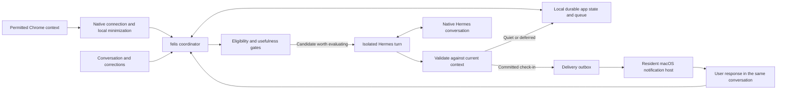

# Proactive outreach: implementation and scaling plan

**Host decision update:** Electron is the selected macOS-first host direction. References below to the Swift menu-bar host describe the superseded host choice. The durable coordinator, native activity connection, staging/promotion, and delivery guarantees remain proposed. See [the desktop build](../../desktop/electron/README.md).

September 9, 2026. Proposed implementation, not an implemented feature or authorization to enable monitoring, notifications, additional tools or new model data flows.

**Recommended approach:** keep the current felis UI and Hermes conversation/task integration, add a resident macOS host, a durable felis-owned coordinator, an explicitly permitted browser-to-native connection, and a separate delivery record for every check-in. Build one complete outreach path before expanding sources or moving to shared infrastructure.

Proactive outreach is not a new mechanism. Focus Bear documents contextual prompts; AI Buddy sends activity-informed desktop notifications; ProactiveAgent implements observation-driven proposals; Hermes and OpenClaw support background wakeups. These establish prior art, not that any candidate delivers felis's intended quality, low upkeep or adoption. Small projects and research demos are engineering evidence, not product validation. [Focus Bear release notes](https://www.focusbear.io/release-notes/v-3-32-487), [AI Buddy](https://github.com/2CoderOK/ai-buddy), [ProactiveAgent interaction](https://github.com/thunlp/ProactiveAgent#interact-with-the-proactive-agent).

**Host recommendation:** [Electron with a macOS-first verification path](desktop-platform.md) takes the resident-host role below, preserving the Python coordinator and approved UI. The native notification, staging, consent, recovery, and scaling contracts remain applicable. The Swift-specific host discussion is an earlier narrow proof option, not the selected platform.

## What the user should experience

Outreach motivates action on the person's own commitments. It should be a grounded, personable nudge or acknowledgment, not an unsolicited preparation plan, solution, or instruction sequence. Calendar context can support follow-through at a useful moment; it does not authorize planning work. Let people choose methods and respond to barriers. Explicitly requested assistance remains possible. This boundary does not increase notification frequency or relax quiet/break/consent gates.

A normal conversation establishes an intention once. With proactive support and selected sources enabled, felis maintains the relevant context while the person works elsewhere. When a supported reason to help arises, a short check-in arrives without a new message or dashboard visit. Opening it returns to the same conversation; a response, correction, dismissal or break affects subsequent behavior. If no intervention is useful, there is no notification.

Successful background work is not measured by how often felis speaks. Measure whether it saves repeated explanation/reporting, preserves intentions accurately, provides useful intervention when warranted, and avoids unwanted interruption. The app can automatically maintain attributed context while leaving unsupported completion claims unknown. A later specifically authorized outcome source can update supported task fields through validated transactions without asking for every routine change.

## System shape

The coordinator and native host remain alive while the main window/browser view is closed. Explicit Quit stops dynamic work. Sleep, logout, a terminated host and revoked permissions are unavailable states, not conditions in which the app can promise to keep reasoning.

## 1. A resident Mac host, without a UI rewrite

Create a small Swift/AppKit menu-bar host that starts and supervises the existing Python service, exposes Open felis, Pause and Quit, and owns macOS notification authorization and callbacks. Retain the web Home and conversation bar. The current `EiloActivityHelper` is a one-shot foreground sampler, not a resident host or notification delegate. Keep that sampling function separate from service ownership. [Current helper](../../activity/native/EiloActivityHelper.swift), [current server lifecycle](../../app/chat_service.py).

Use Apple's `UNUserNotificationCenter` for local notification requests and `UNUserNotificationCenterDelegate` for interaction callbacks. No APNs service is needed for this local route. Register categories for Open and Snooze; replying through the existing dock is sufficient for the first version. Inline notification text reply is a later target-platform check, not an assumed capability. [Apple notification center](https://developer.apple.com/documentation/usernotifications/unusernotificationcenter), [handling actions](https://developer.apple.com/documentation/usernotifications/handling-notifications-and-notification-related-actions).

The host runs only after the user starts/enables it. Opening a window and quitting the app are distinct. Optional launch-at-login uses a separately approved `SMAppService` registration later. Test signed/installed app behavior, sleep/wake and OS Focus; do not bypass notification settings or treat an accepted OS request as proof the user saw it. [Apple service management](https://developer.apple.com/documentation/servicemanagement/smappservice).

Tauri is not required for the first spike. Its sidecar support is relevant to later packaging, but the official notification plugin's Actions API is mobile-only; it cannot be assumed to provide macOS notification action/reply handling without native integration. Preserve the protocol boundary so a later Windows host or shared shell can use it. [Tauri sidecars](https://v2.tauri.app/develop/sidecar/), [notification actions](https://v2.tauri.app/plugin/notification/#actions).

## 2. Native bridge and legacy page bridge

The native Chrome bridge registers at development and standalone startup. It does not enable collection: capture requires an actual optional host grant and a connected extension. The page bridge remains an optional legacy compatibility path. Chrome Native Messaging uses these boundaries:

- The extension service worker opens a native port only under the enabled collection mode. Chrome starts a small native bridge, which connects to the already-running felis host/coordinator; it must not restart collection or the main service after explicit Quit.
- The native-host manifest allows only the felis extension identity. Add the specific `nativeMessaging` permission; retain the same optional study-site grants. Do not add page-content, history, clipboard, screenshot or keystroke access.
- The coordinator requests fresh samples only while the collection grant is valid. The extension reuses its current active-tab, focused-window, origin-grant and stale-request checks, then strips paths/query data before delivery.
- Retain an expiring transport lease and nonce, but make authority the enabled native collection session, not an open webpage. Pause, Quit, revoked site grants, or lost native connection closes the observed session and invalidates pending decisions.
- A native port can keep the extension worker alive, but worker/browser/host restarts still need explicit recovery. A transport reconnect never overrides a paused/off consent state. Reconnection after a transient failure may continue only within the same unexpired enabled session; launch-at-login and automatic resumption after quitting are separate opt-ins.

Chrome documents the native host, extension identity allowlist and required permission, plus native-port lifetime behavior. Its service-worker documentation still requires resilience to unexpected termination. Packaging/registration, host grants, and connected-extension behavior require live verification. [Native Messaging](https://developer.chrome.com/docs/extensions/develop/concepts/native-messaging), [worker lifecycle](https://developer.chrome.com/docs/extensions/develop/concepts/service-workers/lifecycle).

This changes collection lifetime, so it needs a clear product choice describing operation while the window is closed. It does not grant the still-pending permission to send multi-session summaries to Luna. The collector, model exposure and notification destination are separate capabilities. Preserve the already-authorized event lane's own-conversation scope; do not ask again merely to reuse that existing scope. Any additional memory fields, session summaries, sources or tools need a versioned grant listing exact fields, destination, retention and revocation behavior. Until that grant exists, experiments involving the new fields use a fake model only.

## 3. Make initiation an explicit decision pipeline

Implement the policy in layers so every activity sample does not invoke a model:

1. **Normalize and update locally.** Deduplicate inputs, merge adjacent samples, retain source/freshness/coverage, close gaps and update the current context. Device timestamps are clues; use owner receipt time and per-device sequence for ordering, and reject implausibly stale/future observations. Do not infer attention or completion from a duration.
2. **Form candidates only at meaningful points.** Candidate families are an agreed follow-up becoming eligible, a materially changed permitted context relevant to a known intention, or new evidence bearing on an unresolved need from prior conversation. Missing/unshared activity is not proof of procrastination. Repeated identical samples add observed time, not repeated notifications.
3. **Apply cheap gates.** Check current consent, active intentions, pause/break state, freshness, pending human input, duplicate episode, cooldown, available delivery route and budget. Queue no model job when these already rule out outreach. Internal due-time maintenance is allowed to wake the coordinator without sending a notification; it does not impose a fixed coaching schedule.
4. **Ask Hermes whether help is useful.** Supply a bounded, authorized context packet and relevant native conversation. Output a validated `quiet`, `defer` or `check_in` decision with reason category and evidence references. A check-in must be grounded, short and actionable; uncertainty can justify one useful clarification but not a demand to fill in a tracker. A model can suggest a later reconsideration, but the coordinator bounds it by the original user-stated conversational episode, expiry and budget. It cannot invent a recurring obligation, next task, priority change or overdue escalation. A candidate expires unless fresh authorized context or the user renews it.
5. **Revalidate before publication and delivery.** If a new human message, changed goal, break, revoked grant or changed relevant context has made the decision stale, suppress it. The current event driver writes native rows during inference; revalidation alone cannot undo those writes. For the new path, stage background inference in an isolated Hermes candidate session using an authorized, read-only snapshot of the canonical conversation. Record its source session/revision and immutable candidate/run identity. Only a still-current validated outcome may be promoted to canonical history. Stale candidate rows stay outside future canonical prompt/compaction context; provisional UI text is cleared if invalidated. This staging/promotion adapter is required new work. Keep context updates and goal-state transactions separate. Publish no task-update acknowledgment before its validated transaction commits.
6. **Use feedback.** A reply uses the ordinary human lane. Snooze postpones the same follow-up; explicit correction updates the interpretation; dismissal suppresses that episode. Lack of response is ambiguous—it can reflect OS delivery, timing or no need—and must not be called rejection, failure or lack of motivation.

The exact decision families and wording need evaluation. Start from the existing admission rules and correct cases they miss; do not remove restraint simply to make the app look active. User-requested deadlines may be normalized only with a resolved timezone/date and source reference; the current `due_text` wording alone is not a scheduler timestamp.

## 4. Keep Hermes; avoid an unnecessary first migration

The deeper protocol audit refines the earlier recommendation to start by adopting the TUI gateway. **The first outreach proof should retain the current direct `AIAgent` drivers and per-turn subprocess isolation.** The persistent part is the coordinator, queue and native conversation state; a permanently live model object is not necessary for autonomous initiation.

felis's drivers already provide ephemeral task policy, private stream parsing, native display metadata, exact stored-row correlation and staged publication. Ordinary gateway `prompt.submit` accepts only a restricted display-kind option, not the custom felis metadata/finalization contract. The HTTP API has run lifecycle and per-run instructions, but still needs an adapter for felis's commit-before-publication guarantees. [Current human driver](../../app/human_driver.py), [publication transaction](../../app/chat_service.py), [pinned gateway submit](https://github.com/NousResearch/hermes-agent/blob/2237be355906fbe6065ce1815711eee52b2d646e/tui_gateway/methods_prompt.py#L534-L543).

After reliable initiation/delivery works, add a small approved app-context tool surface and curated reusable procedures. The initial candidate is read access to current intentions, relevant felis memory and permitted recent context—not general shell/browser access. Allow enough bounded iterations for those reads, with an exact tool inventory, fixed provider route, cancellation and usage limits. App-owned preference/context projections may supplement native history; do not load unrelated workspace or Codex memory. No current research permission enables these tools or resolves the summary-to-model decision.

A warm worker or gateway can be evaluated later if measured startup overhead or needed client capabilities justify it. Keep one active turn per user/session and one writer to native history. Never run old and replacement writers against the same real session during migration.

### Proposed code boundaries

- Extend `app/chat_service.py` as the single process owner; add `app/outreach_coordinator.py`, `app/outreach_store.py` and `app/outreach_policy.py` for lifecycle, durable jobs and testable gates.
- Adapt `app/event_driver.py` for candidate-session execution, exact native result lookup and idempotent publication; retain the supported direct Hermes API and leave upstream source unchanged.
- Add `desktop/macos/` for the resident host and notification delegate, plus a narrow native-messaging bridge. The host is an authenticated IPC client, not another database writer or generic command-execution endpoint. Use an installation-bound, same-user-protected channel; the current browser client header is not native authentication.
- Extend the existing Chrome worker's transport while preserving its selected-site and foreground checks. Extend the current Home client with exact check-in navigation and interaction receipts; preserve the bottom composer and approved layout.

These filenames are proposed ownership boundaries, not files created by this investigation.

## 5. Durable records and crash recovery

Use a local SQLite store for felis's coordinator. Extend the existing Python server into that sole coordinator/state writer; do not create a second independent state-writing daemon. The Mac host and browser are IPC clients. All human submissions, task controls, collection changes, candidate claims and publication/recovery run through the coordinator's serialized ownership boundary. Migrate app-owned task/consent/meta state into it under one writer before relying on cross-record atomicity; preserve stable task IDs and the existing pure transaction validator. Quiesce both lanes, finish or explicitly preserve pending human publication/recovery, back up and validate the migration, then switch authority once and stop writing the old JSON store. Reject partial-migration startup and competing process owners. Hermes continues to own its separate conversation database. This is a proposed migration, not a file change made during research.

| Record                  | Essential responsibility                                                                                                                                                                  |
| ----------------------- | ----------------------------------------------------------------------------------------------------------------------------------------------------------------------------------------- |
| Context event           | Stable source/device event identity, minimized payload, occurrence/receipt times, consent revision and expiry. Duplicate keys return the existing record.                                 |
| Intention/context state | Existing commitments plus attributed accepted corrections, breaks and unresolved needs; distinct from inferred observations.                                                              |
| Outreach candidate/job  | Stable candidate identity, trigger episode, evidence references, relevant state revision, claim lease, attempt, policy version and expiration.                                            |
| Decision/message link   | Validated quiet/defer/check-in outcome and the exact native Hermes row/session reference. It projects the native message; it does not create a second independent conversation authority. |
| Delivery outbox         | One logical check-in identity, chosen endpoint, current authority epoch, pending/accepted/uncertain/expired state and bounded retries.                                                    |
| Interaction/feedback    | Open, reply, snooze or dismiss linked to that check-in and processed idempotently.                                                                                                        |

Persist the candidate before model work, with its exact staging-session ID, canonical target session/revision and immutable run ID. Mark the attempt started before invoking Hermes. Under the single-owner lock, revalidate and promote the exact staged result through supported native append/tag APIs: publish the typed event and assistant rows with immutable candidate/run metadata, preserving attribution to the one real model run. Persist each row identity; repeated promotion first checks for those same identities/metadata, never searches by similar text. Partial native publication remains invisible until both rows and the app decision are reconciled. App readers continue to gate visibility on the committed outcome.

When the validated native publication exists, atomically save its outcome/message link and enqueue delivery in the app database. There is no transaction spanning that database, Hermes persistence and the OS. Reconciliation queries only the exact felis-designated, Hermes-owned staging/target session lineage and immutable candidate/run markers. Content matching and generic session search are not recovery authorities. If the exact outcome cannot be proved, retain `unknown_outcome` and do not rerun inference automatically. Native append/tag/query behavior and compaction/continuation identity preservation are required isolated tests. Do not enable real background generation until this adapter can keep stale staged text out of later canonical model context. The existing human lane's commit-before-acknowledgment path remains intact.

Notifications use a stable check-in ID as their request identifier. The host must validate the current endpoint and ownership epoch immediately before posting, under the same local dispatch lock used for pause/quit. Bind each callback to the check-in ID, endpoint ID and epoch, and validate it again before any action. A deep link itself is only navigation, never action authorization. Only that identifier is needed for routing/deep links; avoid putting goal/activity content in URLs. Distinguish native message committed, request accepted by the OS, retained in Notification Center where observable, and explicit interaction. None means read or attention. A crash after posting but before saving a receipt can leave an ambiguous attempt; reconcile against available OS/native receipts, and suppress blind immediate reposts when uncertainty remains. One logical message is achievable; exactly-once visual display is not promised.

The local store uses short transactions, appropriate durability settings and a pinned SQLite version with the upstream WAL-reset fix. The official WAL page identifies fixed versions; verify the actual bundled runtime before adding concurrent checkpoint/writer use. The current project Python reported SQLite 3.49.1; do not assume it includes the fix without a verified patched build. This is a dependency gate for the proposed queue, not a claim that existing data is damaged. WAL supports concurrent readers with one writer on the same host, not a shared network filesystem, and multiple attached databases are not jointly atomic in WAL mode. [SQLite WAL](https://www.sqlite.org/wal.html). The queue/outbox pattern must tolerate duplicate attempts and use idempotent consumers. [AWS transactional outbox guidance](https://docs.aws.amazon.com/prescriptive-guidance/latest/cloud-design-patterns/transactional-outbox.html).

## 6. Scale in two separate dimensions

**First, scale usage on one device.** High-frequency sampling, deduplication and aggregation stay local. Bound stored history, pending candidates, prompt size, inference calls, tool iterations and output size. Keep human interaction ahead of optional background work. When capacity is unavailable, expire stale optional candidates rather than drain an old backlog into a burst of check-ins.

**Then, one person across devices.** Keep one logical decision owner and one authoritative app state; devices submit minimized allowed events and act as delivery endpoints. Begin with a single host that stays online, or introduce a shared coordinator when availability warrants it. Do not synchronize live SQLite files through a drive folder. If the decision owner moves between devices/server workers, increment a fencing epoch and accept results only from the current exact owner/epoch. An isolated old owner cannot commit a new decision through the authoritative service. Native dispatch additionally requires a short-lived current endpoint permit; an offline host with an expired permit must not post. Treat cross-device consent/revocation and delivery assignment as authoritative records, not cached preferences.

Select one reachable, eligible endpoint for an interruptive check-in. Other devices can show the same message in history without another alert. Do not fail over to multiple endpoints after an ambiguous acceptance just to increase delivery odds; accept bounded availability limits instead of repeated outreach. Acknowledgment races and offline partitions need tests. Remote revocation and an OS post cannot be one atomic transaction: a request already accepted by the OS may still appear. Bound new posting with short-lived permits and a just-in-time check, withdraw pending/retained notifications where the OS allows it, and record concurrent/uncertain outcomes honestly instead of promising instantaneous global revocation. Remote push services become relevant for later remote/mobile delivery, with their own permissions and observability limits.

**Then, many people.** Move app-owned state/queue to PostgreSQL and partition work by account/user. Workers can claim different due rows with `FOR UPDATE SKIP LOCKED`, but still need short claims, expiry, per-user serialization and fenced completion. This is a queue-consumption technique, not a guarantee of globally consistent reads. [PostgreSQL locking clauses](https://www.postgresql.org/docs/current/sql-select.html).

Isolate identities, native histories, credentials, tool scopes, memory and caches by user. In particular, Hermes has process/global configuration concerns: a worker pool must not switch user homes or OAuth credentials in shared global state without proven isolation. Start with isolated user workers or an explicitly supported tenant boundary. Use fair queues and transactional per-user quotas so one busy user cannot occupy the pool. Do not assume one person's subscription can power other users; account authorization, provider support and a paid/bring-your-own-access model remain unresolved deployment decisions.

No separate message broker is required for the initial design. Consider one only when measured database contention, queue age, scheduled-job volume or recovery complexity justifies it. Redis, Kafka or a workflow engine are not prerequisites for making the first useful check-in happen.

## Illustrative capacity arithmetic, not a benchmark

Assumptions: an eight-hour active day, the current five-second sampling cadence, an illustrative 100 coalesced context changes per user/day, and eight background decisions per user/day. Eight is the current daily call cap, not a recommendation to send eight notifications. Assume 20 seconds per model evaluation solely to illustrate concurrency; real latency must be measured.

| Active users | Raw local samples/day | Coalesced context changes/day | Background evaluations/day | Mean concurrent evaluations over those eight hours |
| -----------: | --------------------: | ----------------------------: | -------------------------: | -------------------------------------------------: |
|            1 |                 5,760 |                           100 |                          8 |                                              0.006 |
|          100 |               576,000 |                        10,000 |                        800 |                                               0.56 |
|       10,000 |            57,600,000 |                     1,000,000 |                     80,000 |                                              55.56 |

The architecture should keep the first column of workload on devices and avoid evaluating every sample. At 10,000 users, 80,000 evaluations with an assumed 2,000 input and 150 output tokens would consume 160 million input and 12 million output tokens/day. This is an arithmetic scenario, not actual model usage, a price quote or a guarantee of affordable operation. Long native histories can exceed the assumed input size. Costs depend on the selected authorized provider and measured payloads; bursts, foreground chat, retries and tool calls require additional capacity. The formula for mean in-flight work is evaluations/day × mean evaluation seconds ÷ active seconds/day.

## Build order and completion gates

| Increment                      | Concrete work                                                                                                                                                                                                                                            | Gate before claiming success                                                                                                                                                                                                                                                                                                                                                                                                                                                                                                                              |
| ------------------------------ | -------------------------------------------------------------------------------------------------------------------------------------------------------------------------------------------------------------------------------------------------------- | --------------------------------------------------------------------------------------------------------------------------------------------------------------------------------------------------------------------------------------------------------------------------------------------------------------------------------------------------------------------------------------------------------------------------------------------------------------------------------------------------------------------------------------------------------- |
| A. Delivery and recovery proof | Separate synthetic session; resident Mac host; durable coordinator/outbox; a new staging/promotion adapter using the existing direct-AIAgent interface; native Open action and same-conversation target. The unmodified event adapter is not sufficient. | First use fake responses to prove coordinator/outbox failure recovery and endpoint behavior. Separately, an isolated native-Hermes proof must verify exact typed-row promotion, stable metadata through export/compaction/continuation and exclusion of incomplete/stale rows from canonical prompts. Then test the complete Home-closed route and a permitted interaction back to the exact conversation. These are requirements, not established adapter capabilities. Actual notification and native inference use require the relevant authorization. |
| B. Permitted input             | Native Messaging bridge, reviewed lifetime/grants, foreground checks, pause/off and session recovery.                                                                                                                                                    | Permitted context reaches the coordinator through the native bridge without an open page; unapproved sites/content do not. Quit/revocation/disconnect stops it, and sleep gaps add no fictitious time.                                                                                                                                                                                                                                                                                                                                                    |
| C. Useful proactive reasoning  | Approved context packet/tools, remembered corrections, selective candidate families, defer/quiet/check-in policy and visible evidence.                                                                                                                   | Real use shows warranted outreach without a fresh user message, appropriate silence, durable correction, no fabricated completion, and less repeated reporting. Mechanical notification success alone does not pass.                                                                                                                                                                                                                                                                                                                                      |
| D. Two devices                 | One authority, endpoint routing, user/owner epochs, reconnect and conflict handling.                                                                                                                                                                     | Concurrent devices do not create duplicate check-ins; late owner commits and expired endpoint permits are rejected; concurrent OS-acceptance/revocation outcomes stay explicit; corrections propagate.                                                                                                                                                                                                                                                                                                                                                    |
| E. Multi-user pilot            | Tenant-isolated workers/state, fair queue and quotas, measured load/usage, supported account model.                                                                                                                                                      | Cross-tenant access tests, burst/retry tests, queue-age/latency targets and a measured per-user cost envelope pass before scale-up.                                                                                                                                                                                                                                                                                                                                                                                                                       |

Failure-injection cases must include a crash before model invocation, after native persistence, before app-outbox commit, after OS acceptance, a human reply during generation, a goal cancellation while delivery waits, duplicate feedback, consent revocation, a late device event, an unavailable endpoint and an expired check-in. Restart recovery must preserve the existing commit-before-acknowledgment behavior and must not create a second native reply after an ambiguous outcome.

The design is feasible in principle using documented APIs, with the native staging/promotion adapter still requiring proof. Notification presentation under OS Focus, actual interruption quality, native-history reconciliation through compaction, Chrome/native reconnection behavior, multi-user provider access and measured capacity remain empirical or authorization gates. No number of passing fixture tests establishes the product's usefulness on its own.

## Research boundary

This plan combines felis source inspection with independent delivery, Hermes protocol, and scaling reviews. Primary documentation from Apple, Chrome, Hermes, SQLite, PostgreSQL, AWS, and Tauri informed the plan. The protocol audit corrected a premature gateway-first recommendation; Tauri's mobile-only Actions API is a concrete implementation constraint. This is an implementation plan with explicit experiments, not a claim that outreach or scale has already been validated.
